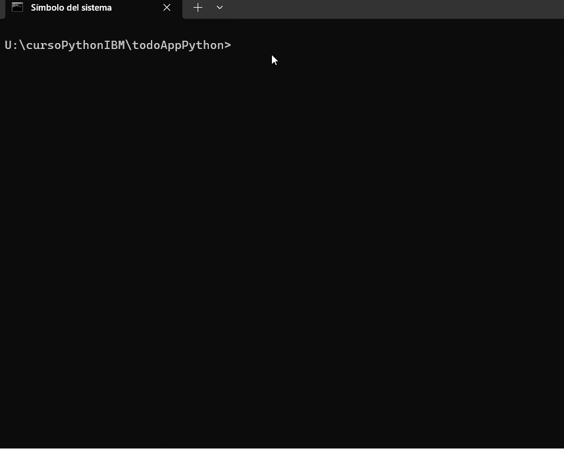
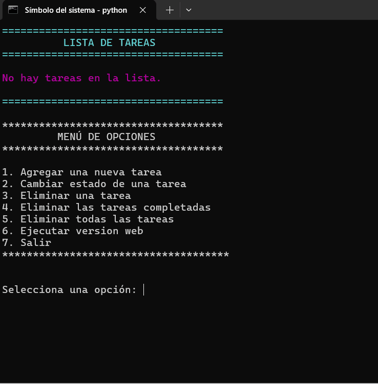
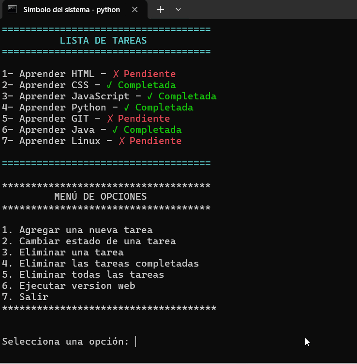
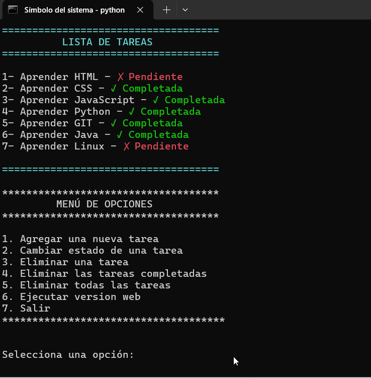
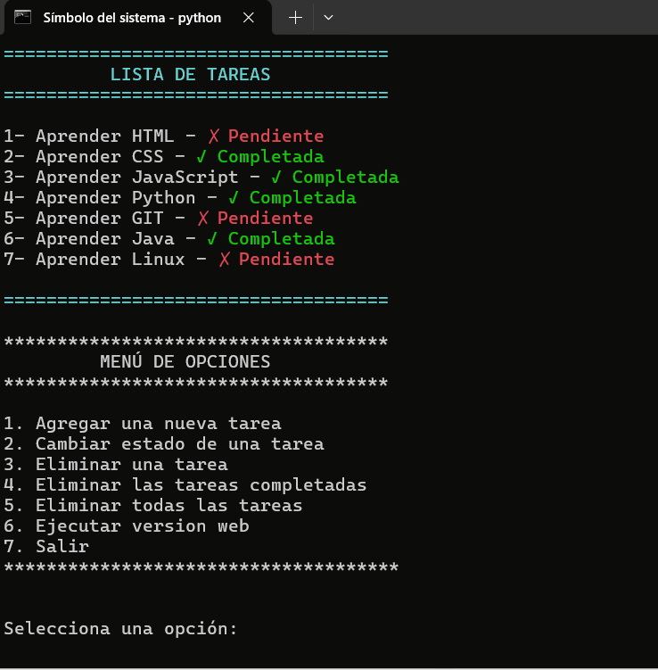
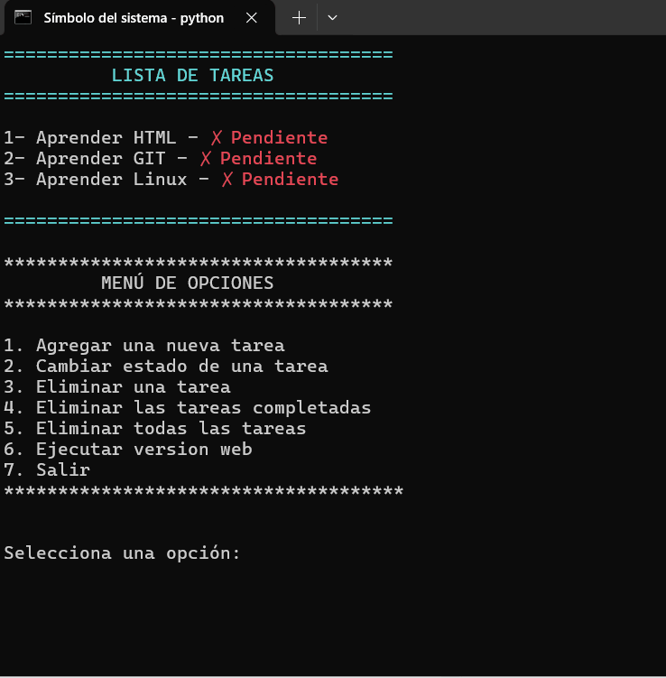
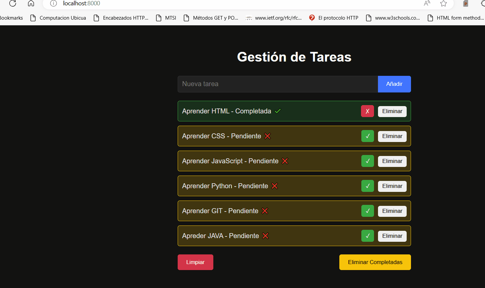

# Manual de Usuario para la Aplicación de Gestión de Tareas

## Tabla de Contenidos

- [Manual de Usuario para la Aplicación de Gestión de Tareas](#manual-de-usuario-para-la-aplicación-de-gestión-de-tareas)
  - [Tabla de Contenidos](#tabla-de-contenidos)
  - [Introducción](#introducción)
  - [Requisitos del Sistema](#requisitos-del-sistema)
    - [Instalación](#instalación)
    - [Uso de la Aplicación](#uso-de-la-aplicación)
      - [Interfaz de Usuario en Consola](#interfaz-de-usuario-en-consola)
      - [Agregar una Nueva Tarea](#agregar-una-nueva-tarea)
      - [Cambiar el Estado de una Tarea](#cambiar-el-estado-de-una-tarea)
      - [Eliminar una Tarea](#eliminar-una-tarea)
      - [Eliminar las Tareas Completadas](#eliminar-las-tareas-completadas)
      - [Eliminar Todas las Tareas](#eliminar-todas-las-tareas)
      - [Ejecutar la Versión Web](#ejecutar-la-versión-web)
      - [Salir](#salir)

## Introducción

La aplicación de gestión de tareas es una herramienta sencilla para gestionar tareas pendientes y completadas. Proporciona una interfaz de usuario en consola y una versión web para mayor flexibilidad.

## Requisitos del Sistema

- Python 3.x
- Módulos estándar de Python (`os`, `sys`, `time`, `subprocess`)
- Acceso a una terminal o consola
- Navegador web (para la versión web)


### Instalación

1. **Clonar el Repositorio**: Clona el repositorio que contiene los archivos `servidor.py`, `gestorTareas.py`, `terminalUI.py` y la carpeta `public` en tu máquina local.

2. **Navegar al Directorio**: Usa la terminal o consola para navegar al directorio donde están los archivos.

```sh
cd path/to/repository
```

2. **Ejecutar la Aplicación en Consola**: Ejecuta el archivo `terminalUI.py`.

```sh
python terminalUI.py
```
```sh
python3 terminalUI.py
```

### Uso de la Aplicación



#### Interfaz de Usuario en Consola

Al iniciar la aplicación, verás un menú de opciones para gestionar tus tareas. A continuación se detallan las opciones disponibles:

#### Agregar una Nueva Tarea

1. Selecciona la opción `1` en el menú.
2. Ingresa el nombre de la nueva tarea.
   - **Reglas para añadir tareas**:
     - El nombre no puede estar vacío.
     - No puede haber dos tareas con el mismo nombre.
3. La aplicación añadirá la tarea a la lista y mostrará un mensaje de confirmación.



#### Cambiar el Estado de una Tarea

1. Selecciona la opción `2` en el menú.
2. Ingresa el número de la tarea cuyo estado deseas cambiar.
   - **Reglas para cambiar el estado**:
     - La lista de tareas no puede estar vacía.
     - Debes ingresar un número válido correspondiente a una tarea existente.
3. La aplicación cambiará el estado de la tarea seleccionada (de `PENDIENTE` a `COMPLETADA` o viceversa) y mostrará un mensaje de confirmación.



#### Eliminar una Tarea

1. Selecciona la opción `3` en el menú.
2. Ingresa el número de la tarea que deseas eliminar.
   - **Reglas para eliminar tareas**:
     - La lista de tareas no puede estar vacía.
     - Debes ingresar un número válido correspondiente a una tarea existente.
3. La aplicación eliminará la tarea seleccionada y mostrará un mensaje de confirmación.




#### Eliminar las Tareas Completadas

1. Selecciona la opción `4` en el menú.
   - **Reglas para eliminar tareas completadas**:
     - La lista de tareas no puede estar vacía.
     - Debe haber al menos una tarea completada.
2. La aplicación eliminará todas las tareas completadas y mostrará un mensaje de confirmación.



#### Eliminar Todas las Tareas

1. Selecciona la opción `5` en el menú.
2. La aplicación eliminará todas las tareas de la lista y mostrará un mensaje de confirmación.



#### Ejecutar la Versión Web

1. Selecciona la opción `6` en el menú.
2. La aplicación intentará abrir el archivo `servidor.py`.
   - **Condiciones para llamar a `servidor.py`**:
     - En Windows, se usa `os.startfile`.
     - En macOS, se usa `open`.
     - En Linux, se usa `xdg-open`.
3. Si no puedes llamar a `servidor.py` desde la terminal, puedes ejecutarlo manualmente:

```sh
python servidor.py
```

3. Abre un navegador web y navega a `http://localhost:8000` para interactuar con la aplicación web.



#### Salir

1. Selecciona la opción `7` en el menú para salir de la aplicación.

